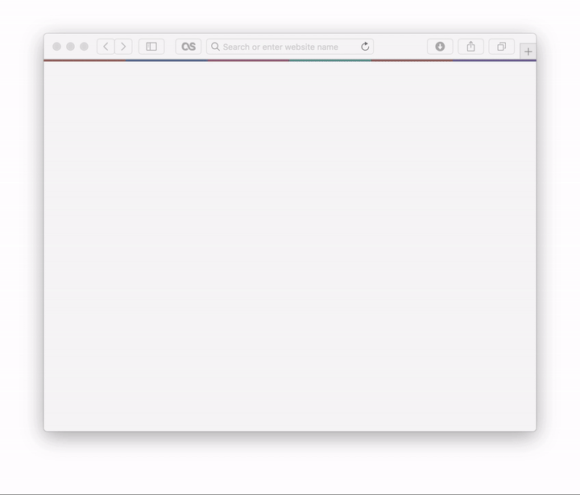
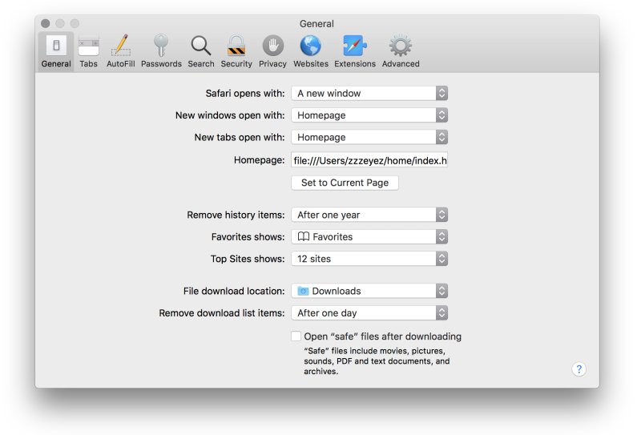

# Pollen

Pollen is a start page that you can navigate with your keyboard.



You can navigate through the links with the Tab button.  The default form, "search", accepts URLs and search terms.  The YouTube and Wikipedia forms also accepts search terms.  The other forms are just static links that you can type Enter to visit.

By default the links are as follows:  Duck Duck Go, YouTube, Wikipedia, Amazon, Reddit, Facebook and Netflix. 

### Installation

Download Pollen to your prefered location and then change your browsers settings so that your homepage points to the included 'index.html'



### Wal

Pollen accepts palettes generated by [Wal](https://github.com/dylanaraps/pywal) using Sassc.

To install Sassc:

```
brew install sassc
```
  
And then you must change the username at the top of `scss/style.scss` to that of your own:

```
nvim ./scss/style.scss
```
  
Now you can expand Wal's colors to your CSS file:

```
sassc --style expanded ./scss/style.scss > ./style.css 
```

